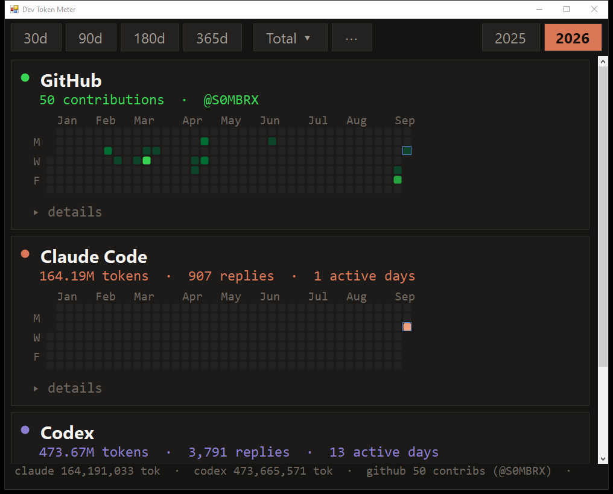

# Dev Token Meter

A single native Windows window showing how much you actually burn across
**Claude Code**, **Codex** and **GitHub** — three contribution-style grids stacked
one above the other, with per-day token counts on hover.



## Why

The usage widgets built into these tools are small, count messages rather than
tokens, hide behind a hover delay, and are only reachable from a "new chat"
screen. This reads the transcripts that are already on your disk and shows the
real numbers, permanently, in one place.

## What it shows

Three grids, top to bottom:

| Grid | Source | Hover shows |
|---|---|---|
| GitHub | `github.com/users/<you>/contributions` (public, no token) | contributions that day, GitHub's own colour levels |
| Claude Code | `~/.claude/projects/**/*.jsonl` | total / output / input / cache write / cache read, replies, sessions |
| Codex | `~/.codex/sessions/**/rollout-*.jsonl` | same breakdown |

Each grid has a collapsed **details** panel with stat tiles, a by-model and
by-project breakdown, and your heaviest sessions.

The toolbar keeps the day counts (30d / 90d / 180d / 365d) as buttons and folds
everything else away: a **Total ▾** menu picks the metric the token grids are
coloured by (total, output, input, cache write, cache read, replies), and **⋯**
holds rescan and the GitHub username. Calendar years sit right-aligned, the way
GitHub lays them out — click one to see Jan–Dec for that year instead of a
trailing window. GitHub always shows contributions regardless of the metric.

## Requirements

Nothing to install. It targets .NET Framework 4.x, which ships with Windows,
and it compiles with the `csc.exe` already in `C:\Windows\Microsoft.NET\`.

## Build

```
build.bat
```

That produces `DevTokenMeter.exe` next to it. Run the exe; no arguments needed.

## GitHub setup

Click **GitHub…** in the toolbar and enter your username, or:

```
DevTokenMeter.exe --github YOUR_USERNAME
```

It's stored in `%LOCALAPPDATA%\DevTokenMeter\config.json`. The public
contribution calendar needs no token or login. Responses are cached for 3 hours.

**Private repos.** GitHub leaves private-repo activity out of the public
calendar, which is why your own profile can say 145 while the public page says
51. If the [GitHub CLI](https://cli.github.com) is installed and logged in
(`gh auth login`), the app also counts your commits on the default branch of
each private repo you own and folds them into the grid — the same figure
github.com shows you when you're signed in. The app never reads the token
itself; it only runs `gh api`. Without `gh` you get the public numbers.

## Notes on the numbers

**Cache reads dominate.** For long agent sessions they're routinely 95%+ of all
tokens, so the "total" is much larger than what you'd think of as spending.
Switch the metric to **Output** or look at the *Fresh (uncached)* tile for the
figure closer to real consumption.

**Codex counts input differently.** Its `input_tokens` already includes
`cached_input_tokens`; Claude reports them as separate fields. The scanner
normalises both to the same shape — fresh input, output, cache write, cache read.

**Older Codex sessions use an older format.** Sessions recorded before
`token_usage_record` existed only carry a cumulative `total_token_usage` on
`event_msg`/`token_count` events. Those are reconstructed by diffing consecutive
totals, and only for files that contain no exact records, so nothing is counted
twice.

Nothing is uploaded anywhere. The only network call is the public GitHub
contributions page.

## Licence

MIT — see [LICENSE](LICENSE).
